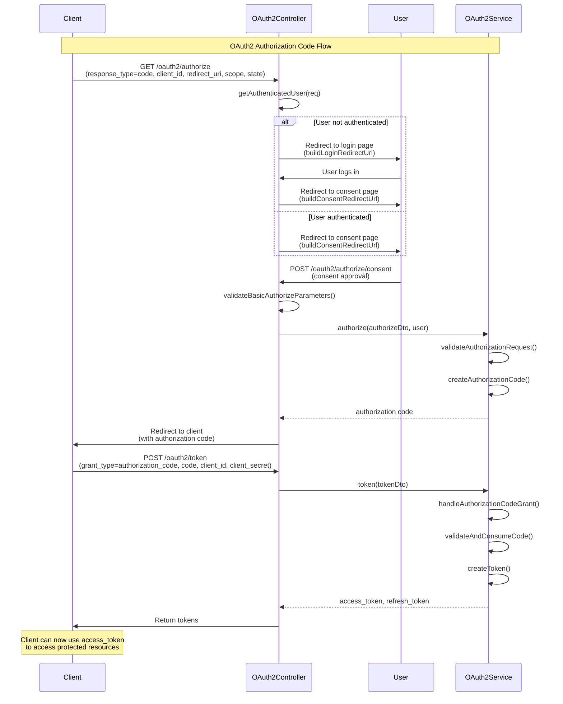

# OAuth2 Authorization Code Flow 다이어그램

이 문서는 FlowAuth 시스템의 OAuth2 Authorization Code Flow의 코드 흐름을 Mermaid 다이어그램으로 시각화한 것입니다.

## 전체 플로우 개요

OAuth2 Authorization Code Flow는 다음과 같은 단계로 진행됩니다:

1. **클라이언트 요청**: 클라이언트가 `/oauth2/authorize` 엔드포인트로 인증 요청
2. **사용자 인증**: 사용자가 로그인되어 있지 않으면 로그인 페이지로 리다이렉트
3. **동의 처리**: 인증된 사용자가 권한 동의를 처리
4. **인증 코드 발급**: 동의 후 authorization code 생성
5. **토큰 교환**: 클라이언트가 authorization code를 사용하여 access token 획득

## Mermaid 시퀀스 다이어그램

## 주요 컴포넌트 설명

### OAuth2Controller

- `/oauth2/authorize`: 인증 시작 엔드포인트
- `/oauth2/authorize/consent`: 사용자 동의 처리 엔드포인트
- `/oauth2/token`: 토큰 발급 엔드포인트
- 사용자 인증 상태 확인 및 리다이렉트 처리

### OAuth2Service

- `authorize()`: 인증 요청 검증 및 authorization code 생성
- `token()`: 토큰 발급 처리 (authorization code grant)
- `validateAuthorizationRequest()`: 요청 파라미터 검증
- `createAuthorizationCode()`: authorization code 생성

### 주요 메서드 플로우

#### authorize 엔드포인트

1. `getAuthenticatedUser()` - 쿠키 또는 헤더에서 사용자 인증 확인
2. 인증되지 않은 경우: `buildLoginRedirectUrl()` → 로그인 페이지 리다이렉트
3. 인증된 경우: `buildConsentRedirectUrl()` → 동의 페이지 리다이렉트

#### authorize/consent 엔드포인트

1. `validateBasicAuthorizeParameters()` - 기본 파라미터 검증
2. `oauth2Service.authorize()` - 인증 처리 및 코드 생성
3. 클라이언트로 authorization code 리다이렉트

#### token 엔드포인트

1. `oauth2Service.token()` - 토큰 발급 요청
2. `handleAuthorizationCodeGrant()` - authorization code grant 처리
3. `validateAndConsumeCode()` - 코드 검증 및 소비
4. `createToken()` - 액세스 토큰 및 리프레시 토큰 생성

## 보안 고려사항

- **Rate Limiting**: 요청 빈도 제한으로 DDoS 방지
- **PKCE**: 코드 교환 공격 방지를 위한 PKCE 지원
- **State Parameter**: CSRF 공격 방지
- **Redirect URI Validation**: 오픈 리다이렉트 공격 방지
- **Token Expiration**: 토큰 만료로 인한 보안 강화

## 관련 파일

- `oauth2.controller.ts`: 컨트롤러 구현
- `oauth2.service.ts`: 서비스 로직 구현
- `authorization-code.service.ts`: 인증 코드 관리
- `token.service.ts`: 토큰 관리
- `scope.service.ts`: 스코프 검증
